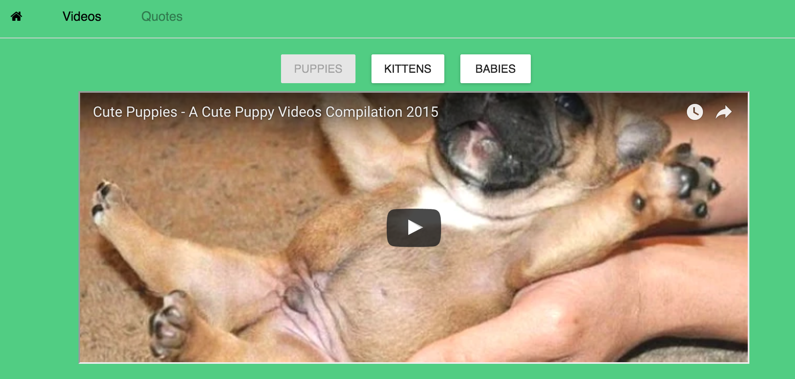

# Exercise-1

In this exercise, we'll build a multi-page application using **React Router**. The application is largely built, and additional information will be provided in the slides about how to complete each step. We'll build three different views:

Landing page:

Videos page:

Quotes page:

This project was bootstrapped with [Create React App](https://github.com/facebookincubator/create-react-app).
